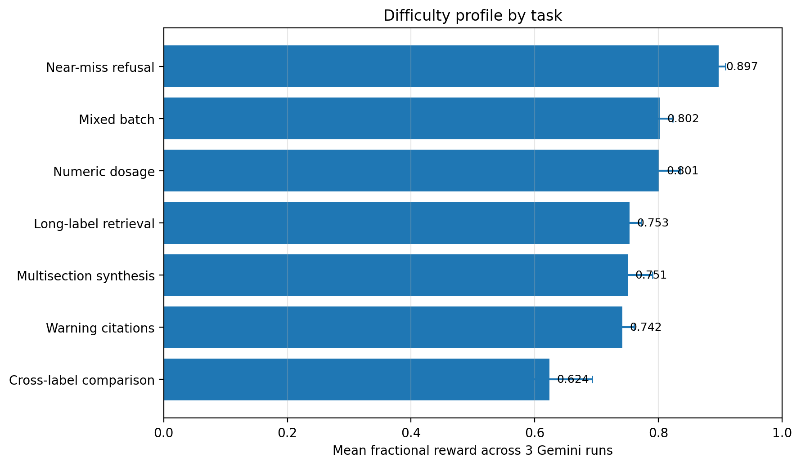

<div align="center">

# FDA-Gemini Benchmark

**A citation-grounded benchmark for reasoning over FDA drug labels**

<p>
  
  
  
  
</p>

<sub>Long-context retrieval · precise citations · calibrated refusal · structured clinical QA</sub>

</div>

---

## Overview

FDA-Gemini Benchmark evaluates how reliably an agent can answer questions from FDA drug labels while staying grounded in the supplied evidence. It tests more than answer similarity: agents must identify the right label, cite real passages, preserve clinical qualifiers, return valid structured output, and refuse claims that the label does not support.

The repository contains Harbor-ready task environments, hidden verifiers, task builders, run artifacts, and analysis reports for both the original FDA-label suite and a deliberately harder challenge set.

## Benchmark at a glance

| | |
|---|---:|
| FDA labels profiled | **704** |
| Source QA rows | **17,207** |
| Harbor task suites | **12** |
| Hard task families | **7** |
| Scored hard-set trials | **23** |
| Hard-set mean fractional reward | **0.700** |

The source corpus contains factual, multihop, and refusal questions. The hard suite adds long-label retrieval, warning extraction, exact dosage recovery, near-miss refusal, multi-section synthesis, cross-label comparison, and mixed batches.

## Task suites

### Hard challenge set

| Task | What it measures |
|---|---|
| `fda-hard-long-label-retrieval` | Finds facts buried in long labels and cites exact passages |
| `fda-hard-warning-citations` | Extracts warnings, risks, precautions, and qualifiers with evidence |
| `fda-hard-numeric-dosage` | Preserves dose, unit, route, frequency, population, and limits |
| `fda-hard-near-miss-refusal` | Rejects adjacent but unsupported clinical claims |
| `fda-hard-multisection-synthesis` | Grounds a combined answer across multiple label sections |
| `fda-hard-cross-label-comparison` | Compares products without transferring facts between labels |
| `fda-hard-mixed-batch` | Combines factual, numeric, citation, refusal, and comparison tasks |

### Original task set

The five original suites cover factual QA, multihop QA, refusal QA, citation retrieval, and mixed-batch execution. Each task is packaged as an isolated Harbor environment under [`samples/`](samples/).

## Current difficulty profile

Across the recorded hard-set evaluation, aggregate strict pass rates were **13.0% pass@1** and **14.3% pass@3**. Fractional scoring shows that many failures are near-misses: the answer is often broadly correct but loses credit for a missing qualifier, unsupported claim, malformed field, or weak citation.

<div align="center">
  
  <br>
  <sub>Mean fractional reward across three Gemini runs in the task-level comparison analysis.</sub>
</div>

Detailed results are available in the [hard question set summary](report/hard_question_set_summary.md), [Gemini Flash run comparison](report/fda_hard_gemini_flash_run_comparison.md), and [trajectory failure analysis](report/fda_hard_gemini_flash_trajectory_failure_analysis.md).

## Repository layout

```text
.
|-- samples/    Harbor tasks, environments, solutions, and hidden verifiers
|-- scripts/    Dataset profiling, task generation, execution, and analysis
|-- tests/      Unit tests for task generation and result analysis
|-- analysis/   Dataset profiles and fractional reward summaries
|-- report/     Benchmark tables, failure analyses, and figures
`-- jobs/       Recorded Harbor run artifacts
```

## Quick start

### 1. Requirements

- Python 3.10 or newer
- Harbor CLI for executing benchmark tasks
- Provider credentials configured in your environment for model-backed runs

The repository does not store API keys. Configure model credentials through Harbor or your shell environment.

### 2. Profile the source data

The scripts default to `labels.jsonl`, `qa.jsonl`, and `qa_toy.jsonl` in the directory above this repository. You can also pass explicit paths:

```bash
python3 scripts/analyze_fda_data.py \
  --labels ../labels.jsonl \
  --qa ../qa.jsonl \
  --qa-toy ../qa_toy.jsonl
```

### 3. Build the hard tasks

```bash
python3 scripts/build_hard_fda_tasks.py \
  --labels ../labels.jsonl \
  --qa ../qa.jsonl \
  --output-root samples \
  --overwrite
```

The builder creates a public question-and-label split plus hidden gold data for each verifier. Gold answers, expected terms, citations, and context are excluded from the public workspace.

### 4. Run an evaluation

Run one task directly:

```bash
harbor run \
  -o logs \
  -p samples/fda-hard-numeric-dosage \
  -a terminus-2 \
  -m gemini/gemini-3.5-flash
```

Or execute the original five-task suite with the included runner:

```bash
bash scripts/run_all_gemini.sh
```

The companion `run_all_nop.sh` and `run_all_oracle.sh` scripts provide lower- and upper-bound checks.

### 5. Analyze results

```bash
python3 scripts/analyze_harbor_results.py --input jobs --output report
python3 scripts/summarize_fractional_rewards.py --input jobs --output-dir analysis
```

### 6. Run the tests

```bash
python3 -m unittest discover -s tests -v
```

## Scoring philosophy

Each answer is evaluated at multiple levels:

1. **Completion** - every question ID appears exactly once in valid JSON.
2. **Grounding** - cited passage IDs exist in the correct FDA label.
3. **Evidence** - supporting quotes occur in the cited passages.
4. **Content** - required facts and clinically important qualifiers are present.
5. **Restraint** - unsupported details and cross-label contamination are penalized.
6. **Structure** - task-specific dosage, comparison, and refusal fields are valid.

This produces both strict pass/fail outcomes and fractional rewards that make near-miss behavior visible.

## Research use

This benchmark is intended for model evaluation and retrieval research. It is not a clinical decision-support system, and benchmark outputs should not be used as medical advice.
